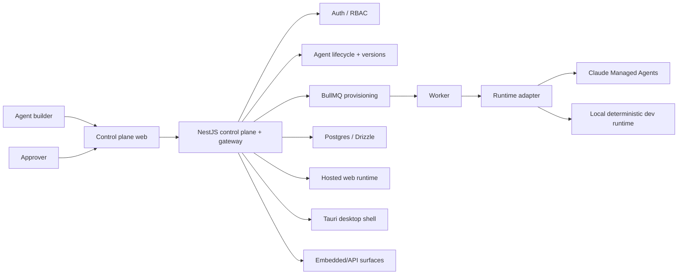

# Architecture Review — Agent Studio

`agent-studio` is the portfolio's canonical **governed agent application factory**: define and version an agent, review it, provision an approved runtime, then publish it as a web app, desktop shell, embedded copilot or API.

## System context



## Lifecycle architecture

```text
Draft agent definition
      ↓
Immutable version
      ↓
Review / separation of duties
      ↓
Approved or rejected
      ↓ approved
Provision runtime
      ↓
Publish application surface
      ↓
Operate / observe
      ↓
Supersede, deactivate or revoke
```

A published application should always be traceable to an approved version and runtime configuration.

## Runtime provider boundary

`AgentRuntimeAdapter` is the strategic seam. The domain model should not depend on a provider-specific conversation/session shape. Provider packages translate between the platform's runtime events and the execution provider.

The local deterministic runtime is a development capability, not a silent production fallback.

## Trust boundary

### Client surfaces

- control plane, hosted runtime, desktop shell and embeds
- collect user interaction and render runtime state
- do not receive provider/master encryption secrets

### API/control plane

- identity and authorization
- version/lifecycle enforcement
- secrets access
- application publishing policy
- runtime/session gateway

### Worker/runtime layer

- provider provisioning/execution
- retryable asynchronous jobs
- failure and lifecycle callbacks
- must reject stale/revoked versions where applicable

## Failure architecture

| Failure | Required behavior |
| --- | --- |
| runtime provider unavailable | fail closed; do not silently switch to local runtime in production |
| provisioning job fails | preserve version/approval history and expose retryable job state |
| stale version tries to run | reject when no longer active/published |
| approval rejected | do not provision/publish protected runtime |
| secret missing | fail startup/provision path explicitly |
| desktop session invalid | deny gateway/runtime access |
| worker retry duplicates work | idempotency should prevent duplicate irreversible provisioning |

## Consolidation direction

`agent-studio` is the canonical successor for managed-agent/control-plane work. Useful lifecycle/security concepts from earlier `agent-control-plane` experiments should converge here rather than creating multiple public platforms with overlapping scope.

## Architect review checklist

- [ ] Domain lifecycle is provider-neutral.
- [ ] Approved version is immutable and traceable.
- [ ] Separation-of-duties rules cannot be bypassed by the client.
- [ ] Local development runtime is impossible to activate silently in production.
- [ ] Secrets remain server-side/encrypted.
- [ ] Async provisioning is observable and retry-safe.
- [ ] Revoked/superseded configurations cannot continue as if current.

## Portfolio role

- `frontend-ai-patterns` defines trustworthy interface primitives.
- `ngx-copilot-platform` shows an application-grade Angular copilot platform.
- `agent-studio` governs agent lifecycle, runtime and publishing.
- `org-ai-force` shows the enterprise workspace consuming agent/tool concepts.
