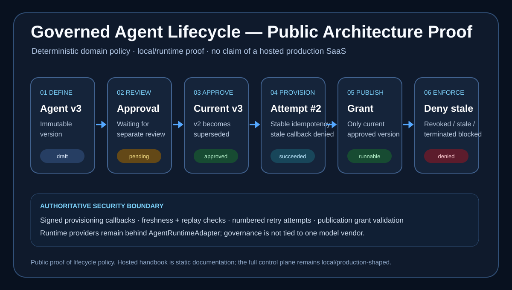

# Agent Studio

Enterprise Agent Application Factory: define an agent once, govern it centrally, and publish it as a secure web application, desktop shell, embedded copilot, or API.

Claude Managed Agents is the first execution provider. The domain model stays provider-neutral through an `AgentRuntimeAdapter` boundary.

**[Live handbook](https://ankitparekh007.github.io/agent-studio/)** · **[Public proof](docs/public-proof.md)** · **[Engineering docs](docs/)** · **[Roadmap](docs/roadmap.md)**

## Review This Repo In 30 Seconds

Agent Studio is the **governance/control-plane** proof in this portfolio.

The shortest architecture story is:

`agent definition → immutable version → review → approval → provisioning → publication → runtime access → revocation`

<p align="center">
  
</p>

<p align="center"><em>Lifecycle policy proof generated from the repository's implemented governance rules. The hosted handbook is static documentation; this image does not claim that the full control plane is a public production SaaS.</em></p>

Three things distinguish this from a generic agent builder:

- only the **current approved immutable version** is runnable;
- provisioning retries and asynchronous callbacks are idempotent, attempt-aware, signed, and replay-protected;
- publication/runtime access is checked against version and agent lifecycle state before use.

Use the [live handbook](https://ankitparekh007.github.io/agent-studio/) for the fastest hosted architecture review and [Public Proof](docs/public-proof.md) for the 30-second / 3-minute / 15-minute evaluation path.

## Governance Proof Points

The domain and API layers now enforce production-shaped lifecycle rules:

- approving a waiting version supersedes the previous approved version without mutating historical records
- stale, rejected, superseded, or otherwise non-current versions cannot start runtime sessions
- provisioning uses stable agent/version/channel idempotency keys
- failed provisioning retries create numbered attempts instead of ambiguous duplicate work
- stale provisioning callbacks are rejected
- HMAC-SHA256 callback verification is enforced at the API edge
- callback freshness and callback-id replay protection are explicit
- publication grants fail closed for revoked, superseded, stale-version, or terminated-agent conditions

These are portable application rules, not UI-only checks.

## Quick start

```bash
# Prerequisites: Node 20+, pnpm 8.7+, Docker
cp .env.example .env
docker compose up -d   # Postgres :55446, Redis :6380
pnpm install
pnpm db:migrate
pnpm db:seed
pnpm dev
```

- Control plane: http://localhost:3000
- Hosted agent apps: http://localhost:3001
- API + Agent Gateway: http://localhost:4000

Default seed users (development only):

- Owner: `owner@example.com` / `Password123!`
- Approver: `approver@example.com` / `Password123!` (used for separation-of-duties approvals)

## Workspace

| Path | Purpose |
| --- | --- |
| `apps/control-plane-web` | Builder, playground, Application Studio, reviews |
| `apps/agent-web-runtime` | Hosted published applications |
| `apps/desktop-shell` | Tauri 2 desktop client (keychain session + gateway chat) |
| `apps/api` | NestJS control plane + Agent Gateway + signed provisioning callback boundary |
| `apps/worker` | BullMQ provision and background jobs |
| `packages/domain` | Types, lifecycle/version/provisioning/publication state policy |
| `packages/database` | Drizzle schema, migrations, seed |
| `packages/application-templates` | Studio templates + studioConfig schema |
| `packages/auth` | Better Auth configuration |
| `packages/authorization` | Server-side RBAC |
| `packages/runtime-core` | Adapter interface + event types |
| `packages/runtime-local` | Development-only runtime (explicit opt-in) |
| `packages/runtime-claude` | Claude Managed Agents adapter |
| `packages/config` | Zod environment validation |
| `packages/ui` | Shared UI primitives |

## Runtime providers

- `local` — deterministic streaming for demos. Requires `RUNTIME_ALLOW_LOCAL=true` and is **blocked in production**.
- `claude` — Anthropic Managed Agents (`managed-agents-2026-04-01`). Requires `ANTHROPIC_API_KEY`. Fails closed if unset. Never falls back to local silently.

## Public Demo Strategy

The public hosted surface is the **static HonKit handbook**, not a claim that the full Agent Studio control plane is running as a public SaaS.

For runtime proof, use the local deterministic runtime and focus the walkthrough on governance states:

1. define or inspect an agent;
2. create a new immutable version;
3. move it through review/approval;
4. explain superseding of the prior approved version;
5. start provisioning and show attempt/idempotency policy;
6. show publication access checks and revocation;
7. finish at the provider-neutral runtime adapter boundary.

The editable visual source is [`docs/assets/public-proof/governed-lifecycle-proof.svg`](docs/assets/public-proof/governed-lifecycle-proof.svg). A current hosted-handbook screenshot is also retained at [`docs/assets/public-proof/handbook-home.png`](docs/assets/public-proof/handbook-home.png).

See [docs/public-proof.md](docs/public-proof.md) for the exact reviewer sequence.

## Documentation

- **Live handbook (GitHub Pages):** [ankitparekh007.github.io/agent-studio](https://ankitparekh007.github.io/agent-studio/)
- **Public proof:** [`docs/public-proof.md`](docs/public-proof.md)
- **Handbook source:** [`handbook/`](handbook/) — run `pnpm docs:install && pnpm docs:dev`
- **Engineering docs:** [`docs/`](docs/) — product vision, architecture, security, local setup, testing, deployment, and roadmap

The Pages deployment builds the HonKit handbook on pushes that change handbook content and performs a post-deploy HTTP smoke check. A green deployment proves that the hosted documentation surface is reachable; it does not imply that the local/full-stack runtime is publicly hosted.

## Production package

Full-stack containers (API, worker, Postgres, Redis, control plane, hosted + embed runtimes):

```bash
cp .env.production.example .env.production
# set POSTGRES_PASSWORD, BETTER_AUTH_SECRET, SECRETS_MASTER_KEY, ANTHROPIC_API_KEY
pnpm deploy:up
pnpm smoke:deploy
```

See [`docs/operations/deployment.md`](docs/operations/deployment.md).

## Scripts

| Command | Description |
| --- | --- |
| `pnpm dev` | Start API, worker, and web apps |
| `pnpm lint` / `typecheck` / `test` / `build` | Quality gates |
| `pnpm db:migrate` | Apply SQL migrations |
| `pnpm db:seed` | Load development seed data (refuses in production) |
| `pnpm smoke` / `smoke:playground` / `smoke:application-studio` / `smoke:desktop` / `smoke:governance` | API smokes (stack must be running) |
| `pnpm deploy:up` / `deploy:down` / `smoke:deploy` | Production Compose stack |
| `pnpm desktop:dev` | Run Tauri desktop shell (requires Rust toolchain) |

## What Is Demo vs Production-Shaped

| Surface | Status |
| --- | --- |
| public HonKit handbook | static hosted documentation |
| lifecycle proof board | generated architecture visualization of implemented domain/API policy |
| local deterministic runtime | demo/development only |
| immutable version policy | real portable domain policy |
| provisioning retries/idempotency | real portable domain policy |
| signed callback verification | real API-edge implementation |
| publication revocation checks | real portable domain policy |
| Docker production package | production-shaped packaging, not a claim of hosted adoption |
| Claude runtime adapter | real provider integration requiring credentials |

## Ecosystem Path

**Learn → Pattern → Run → Platform → Govern → Operate**

[AI Tools Cheatsheets](https://github.com/AnkitParekh007/ai-tools-cheatsheets) → [Frontend AI Patterns](https://github.com/AnkitParekh007/frontend-ai-patterns) → [Angular AI Copilot Starter](https://github.com/AnkitParekh007/angular-ai-copilot-starter) → [ngx-copilot-platform](https://github.com/AnkitParekh007/ngx-copilot-platform) → **Agent Studio** → [Org AI Force](https://github.com/AnkitParekh007/org-ai-force)
