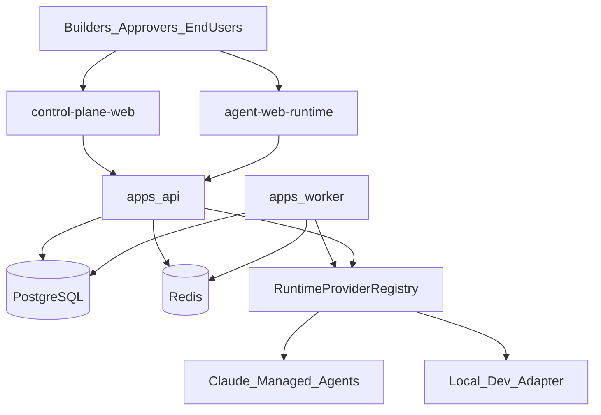

# System architecture

## Context

## Bounded contexts

| Context | Responsibility |
| --- | --- |
| Identity & tenancy | Users, orgs, memberships, sessions, API keys |
| Authorization | Roles, permissions, server-side policy checks |
| Agent management | Definitions, drafts, lifecycle |
| Versioning & approvals | Immutable versions, diffs, approve/reject |
| Runtime | Adapter registry, deployments, sessions, events |
| Applications | Branding, publications, hosted routes |
| Observability | Audit, usage, correlation IDs |

## Agent Gateway

All generated applications talk only to the Agent Gateway:

- Authenticate caller
- Authorize publication access
- Resolve active approved version
- Start/stream/cancel sessions via runtime adapter
- Enforce per-org rate limits, concurrent session caps, monthly spend, and session timeouts
- Persist sanitized events, usage, and audit records

Streaming uses Server-Sent Events (SSE).

## Phase 0 gap summary

| Area | Status at Phase 0 | Target after first slice |
| --- | --- | --- |
| Monorepo | Empty | Scaffolded |
| Auth / tenancy | Missing | Better Auth + orgs/RBAC |
| Agent versions | Missing | CRUD + approval state machine |
| Runtime | Missing | Local + Claude adapters |
| Gateway | Missing | Session start + SSE |
| Hosted apps | Missing | `/{org}/{app}` runtime |
| Desktop | Tauri 2 shell (`apps/desktop-shell`) | Keychain session + gateway chat (Phase 6) |
| Skills/MCP/Knowledge | Org catalogs + version attachments | Catalogs only today; not live MCP/RAG runtimes; secrets stay server-side |
